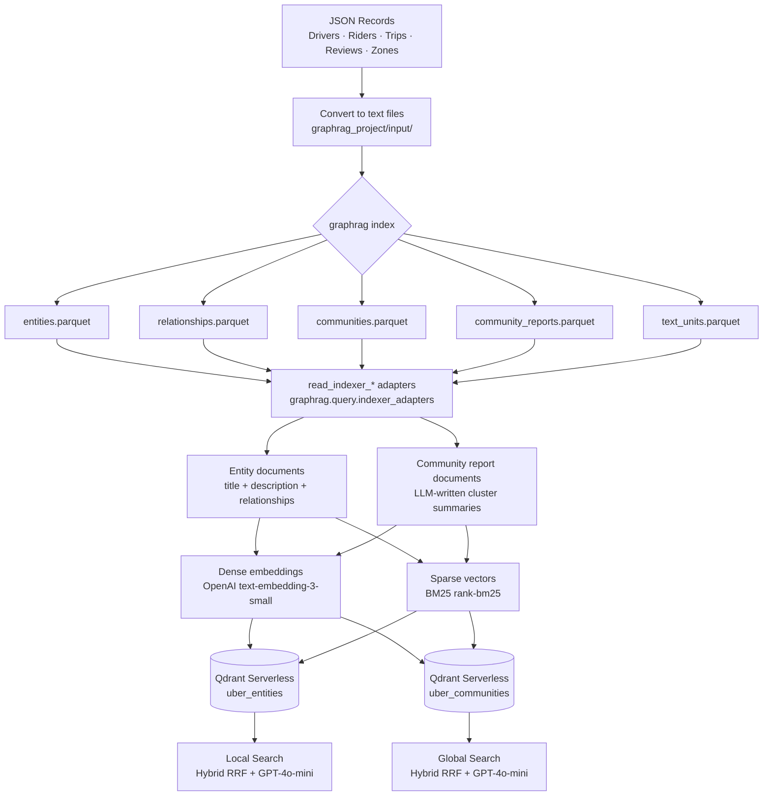
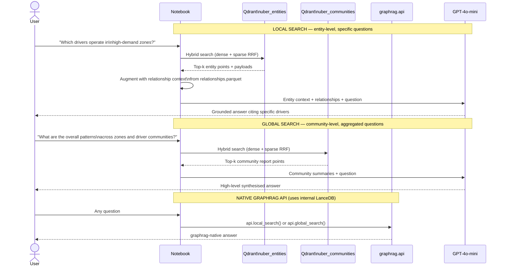

# GraphRAG + Qdrant — Uber-like Ride Marketplace PoC

A Jupyter notebook demonstrating how to combine **Microsoft GraphRAG** and **Qdrant Serverless** to build a hybrid-search, knowledge-graph-aware RAG system — using an Uber-like ride marketplace as the example domain.

---

## Architecture Overview

```
┌─────────────────────────────────────────────────────────────────────────┐
│  SOURCE DATA  (JSON arrays — mimicking relational DB tables)            │
│  drivers · riders · trips · reviews · zones                             │
└───────────────────────────────┬─────────────────────────────────────────┘
                                │  converted to rich text files
                                ▼
┌─────────────────────────────────────────────────────────────────────────┐
│  MICROSOFT GRAPHRAG INDEXING PIPELINE                                   │
│                                                                         │
│  Text files ──► Entity extraction (LLM)                                 │
│                        │                                                │
│                        ▼                                                │
│              Relationship mapping (LLM)                                 │
│                        │                                                │
│                        ▼                                                │
│           Community detection (Leiden algorithm)                        │
│                        │                                                │
│                        ▼                                                │
│         Community summarisation (LLM) ──► community_reports.parquet    │
│                                                                         │
│  Internal vector store: LanceDB (managed by graphrag, not modified)     │
│  Outputs: entities.parquet · relationships.parquet                      │
│           communities.parquet · community_reports.parquet               │
│           text_units.parquet                                            │
└───────────────┬───────────────────────────────┬─────────────────────────┘
                │ load via read_indexer_*        │ load via read_indexer_*
                ▼                               ▼
   ┌────────────────────┐           ┌─────────────────────────┐
   │  Entity documents  │           │  Community report docs  │
   │  (title + desc +   │           │  (LLM-written summaries │
   │   relationships)   │           │   per Leiden cluster)   │
   └────────┬───────────┘           └────────────┬────────────┘
            │                                    │
            ▼                                    ▼
   ┌──────────────────────────────────────────────────────────┐
   │  EMBEDDING LAYER                                         │
   │  Dense  : OpenAI text-embedding-3-small (1536d, cosine)  │
   │  Sparse : BM25 term weights (rank-bm25, rebuilt on       │
   │           every new ingestion for OOV token support)     │
   └──────────────────────────┬───────────────────────────────┘
                              │
                              ▼
   ┌──────────────────────────────────────────────────────────┐
   │  QDRANT SERVERLESS  (our hybrid search layer)            │
   │                                                          │
   │  uber_entities    — named vectors: dense + sparse        │
   │  uber_communities — named vectors: dense + sparse        │
   │                                                          │
   │  CRUD: upsert · retrieve · set_payload+re-embed · delete │
   └──────────────────────────┬───────────────────────────────┘
                              │
              ┌───────────────┴───────────────┐
              ▼                               ▼
   ┌──────────────────────┐       ┌───────────────────────────┐
   │  LOCAL SEARCH        │       │  GLOBAL SEARCH            │
   │  Hybrid RRF on       │       │  Hybrid RRF on            │
   │  uber_entities       │       │  uber_communities         │
   │  + relationship ctx  │       │  + community report ctx   │
   │  → GPT-4o-mini       │       │  → GPT-4o-mini            │
   └──────────────────────┘       └───────────────────────────┘
```

---

## Data Flow (Mermaid)



---

## Search Paths (Mermaid)



---

## Notebook Sections

| # | Section | Description |
|---|---------|-------------|
| 1 | Install Dependencies | `pip install graphrag>=2.0.0 qdrant-client>=1.10.0 ...` |
| 2 | Configuration | Colab Secrets OR `.env` — with early validation |
| 3 | Source Data | Uber JSON arrays: 5 drivers, 5 riders, 6 trips, 7 reviews, 4 zones |
| 4 | Prepare Input Files | JSON → rich narrative text files for graphrag |
| 5 | Init GraphRAG Project | `settings.yaml` (v2 format), `.env` for API key |
| 6 | Run GraphRAG Index | LLM extraction + Leiden communities + parquet outputs |
| 7 | Load Parquet Outputs | `read_indexer_entities`, `read_indexer_reports`, etc. |
| 8 | Prepare Qdrant Documents | Entity docs + community report docs |
| 9 | Sparse Vectors (BM25) | `rank-bm25` with `rebuild_bm25()` for live ingestion |
| 10 | Create Qdrant Collections | `uber_entities` + `uber_communities` (dense + sparse named vectors) |
| 11 | CRUD Operations | Create · Read · Update (re-embeds vectors) · Delete |
| 12 | Dense / Sparse / Hybrid Search | Qdrant RRF fusion across both vector spaces |
| 13 | Local GraphRAG Search | `graphrag.api.local_search` + Qdrant hybrid layer |
| 14 | Global GraphRAG Search | `graphrag.api.global_search` + Qdrant community hybrid |
| 15 | Live Ingestion Demo | New driver → `rebuild_bm25` → embed → upsert |
| 16 | Search Comparison | Dense vs Sparse vs Hybrid vs Local GR vs Global GR |
| 17 | Summary | Architecture recap + production patterns |

---

## Quick Start

### Prerequisites

- Python 3.11+
- OpenAI API key
- Qdrant Serverless cluster ([free tier available](https://qdrant.tech/))

### Local Jupyter

```bash
git clone https://github.com/cloudbloqavi/graph-rag-qdrant.git
cd graph-rag-qdrant
pip install -r requirements.txt

cp .env.example .env
# Fill in OPENAI_API_KEY, QDRANT_URL, QDRANT_API_KEY in .env

jupyter notebook graph_rag_qdrant_poc.ipynb
```

### Google Colab

1. Open the notebook in Colab
2. Click the **🔑 Secrets** icon in the left sidebar
3. Add three secrets: `OPENAI_API_KEY`, `QDRANT_URL`, `QDRANT_API_KEY`
4. Toggle **Notebook access** on for each
5. Run all cells top to bottom

> **Note:** Section 6 (`graphrag index`) calls the OpenAI API ~15–30 times.
> Estimated cost: **<$0.10** with `gpt-4o-mini`. Runtime: **2–5 minutes**.

---

## Two-Layer Vector Store Design

GraphRAG uses **LanceDB internally** during indexing — this is managed by the `graphrag` library and is not modified. Our **Qdrant layer is independent** and built from the parquet outputs:

| Layer | Store | Purpose |
|-------|-------|---------|
| Internal (graphrag) | LanceDB | Used by `graphrag.api.local_search` / `global_search` |
| External (ours) | Qdrant Serverless | Hybrid RRF search + CRUD + programmatic control |

Both layers are demonstrated in Sections 13 & 14 side-by-side.

---

## Stack

| Component | Technology |
|-----------|-----------|
| Knowledge graph extraction | Microsoft GraphRAG (`graphrag>=2.0.0`) |
| Community detection | Leiden algorithm (via graphrag) |
| Community summarisation | OpenAI GPT-4o-mini |
| Dense embeddings | OpenAI `text-embedding-3-small` (1536d) |
| Sparse vectors | BM25 (`rank-bm25`) |
| Vector store | Qdrant Serverless |
| Hybrid fusion | Qdrant RRF (Reciprocal Rank Fusion) |
| Answer generation | OpenAI GPT-4o-mini |
